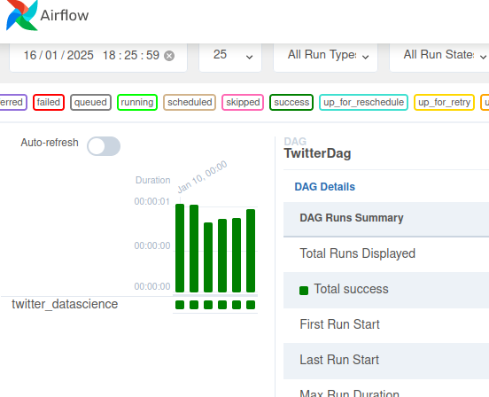
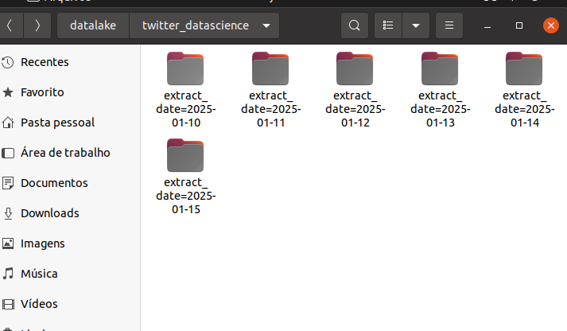

# Extração de Dados de uma API Fictícia do X

## **Descrição do Projeto**
O objetivo principal deste projeto é realizar a extração de tweets relacionados a uma palavra-chave, utilizando uma API fictícia do X (anteriormente conhecido como Twitter). Os dados serão armazenados de forma organizada em um Data Lake, separados por data.

---

## **Tecnologias Utilizadas**
- **Python 3.9**
- **Apache Airflow**

---

## **Requisitos**
Por conta de algumas dependências do Apache Airflow que funcionam somente no Linux, é necessário que seu computador utilize esse sistema operacional. Caso contrário, você pode optar por:
- Usar o **Windows Subsystem for Linux (WSL)**;
- Ou configurar uma **máquina virtual Linux**.

---

## **Iniciando o Projeto**
O projeto foi desenvolvido em um ambiente virtual para garantir um ambiente controlado. Siga os passos abaixo:

1. **Acesse o diretório raiz do projeto**:
   Certifique-se de que você está no diretório principal do projeto.

2. **Crie o ambiente virtual**:
   Execute o seguinte comando no terminal para criar o ambiente virtual:
   
   ```python3.9 -m venv venv```


# Configuração do Ambiente Virtual e Instalação do Apache Airflow

## Etapas para Instalação e Configuração

### 1. Configuração das Variáveis para Instalação

Antes de iniciar, defina as versões do Airflow e Python, além do URL para os arquivos de restrições de dependências. Utilize os comandos abaixo:


# Versão do Airflow
```AIRFLOW_VERSION=2.3.2```

# Versão do Python
```PYTHON_VERSION=3.9```

# URL das Restrições de Dependências

```CONSTRAINT_URL="https://raw.githubusercontent.com/apache/airflow/constraints-${AIRFLOW_VERSION}/constraints-${PYTHON_VERSION}.txt```

### 2. Instalação do Apache Airflow

Instale o Apache Airflow com o suporte necessário (PostgreSQL, Celery e Redis), usando o comando pip:

```pip install "apache-airflow[postgres,celery,redis]==${AIRFLOW_VERSION}" --constraint "${CONSTRAINT_URL}"```


### 3. Configuração da Variável de Ambiente

Antes de iniciar o Airflow, configure a variável de ambiente AIRFLOW_HOME para apontar para o diretório de pipelines. Execute o comando a seguir no terminal:

```export AIRFLOW_HOME=$(pwd)/airflow_pipeline```


### 4. Inicialização do Airflow
Agora, basta iniciar o Airflow com o comando:


```airflow standalone```


## **Rodando o Projeto**

### 1. Abra o navegador e acesse a seguinte URL

```http://localhost:8080```

### 2. DAG
Você verá uma DAG com o nome de **TwitterDag**. Execute-a e, se tudo der certo, o processo ficará com a cor verde.



### 3. Abrindo os arquivos
Se tudo deu certo, os arquivos extraídos da API estarão na pasta **datalake**.




